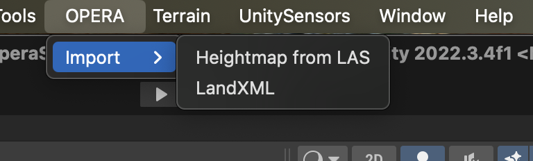
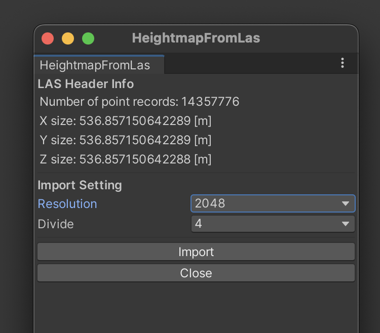
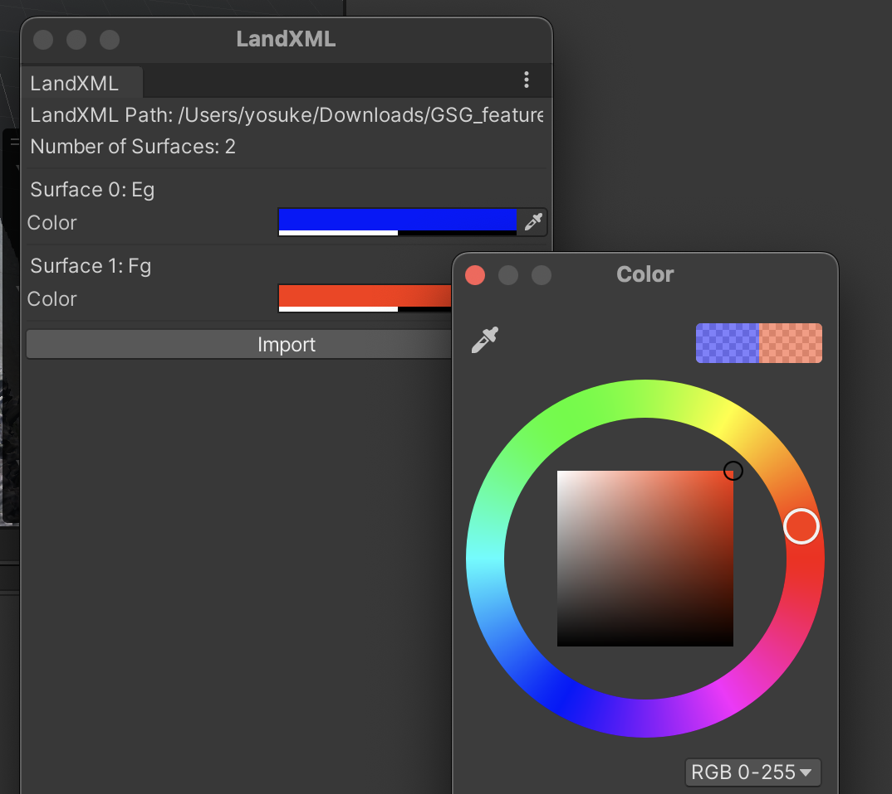
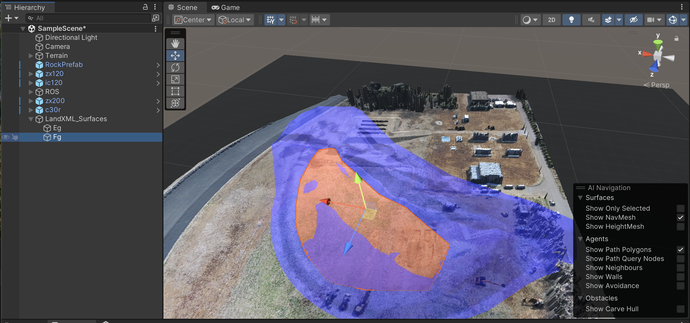

3D形状データを地形モデルとして取り込む方法
============================================

3D形状データ(LAS/LAZとLandXML)を地形として取り込む方法を説明します。

.. note::
    本機能は試験的機能として提供しています。データがうまく取り込めない場合は、GitHubのissueとしてご連絡ください。

LAS/LAZデータの取り込み
------------------------

Unityのメニューから `OPERA > Import > Heightmap from LAS` を選択し、LAS/LAZファイルを選択します。

LAS/LAZファイルを選択すると、以下のような設定画面が表示されます。

「Resolution」は、ハイトマップの解像度を指定します。解像度が高いほど、地形の精度が向上しますが、計算量も増加します。

「Divide」は、地形を分割する数を指定します。大きなLASデータを取り込む際には、シミュレーション速度が低下する可能性があります。その場合は、地形を分割することで、シミュレーション速度を向上させることができます。

LandXMLデータの取り込み
------------------------

LandXMLおよびJ-LandXMLのSurface要素(TIN型)を地形として取り込むことができます。

Unityのメニューから `OPERA > Import > LandXML` を選択し、LandXMLファイルを選択します。

LandXMLファイルを選択すると、以下のようにSurface要素が一覧表示され、何色で取り込むかの設定ができます。

取り込んだSurface要素は、HierarchyパネルのLandXML_Surfaces以下に半透明のゲームオブジェクトとして表示されます。
この時点ではSurface要素には当たり判定はありません。設計図面を画面に重畳する用途として使用してください。

Surface要素を当たり判定のある地形に変換するには、Hierarchyパネルから変換したいゲームオブジェクトを選択して、メニューから `Terrain > Object to Terrain` を選択してください。
