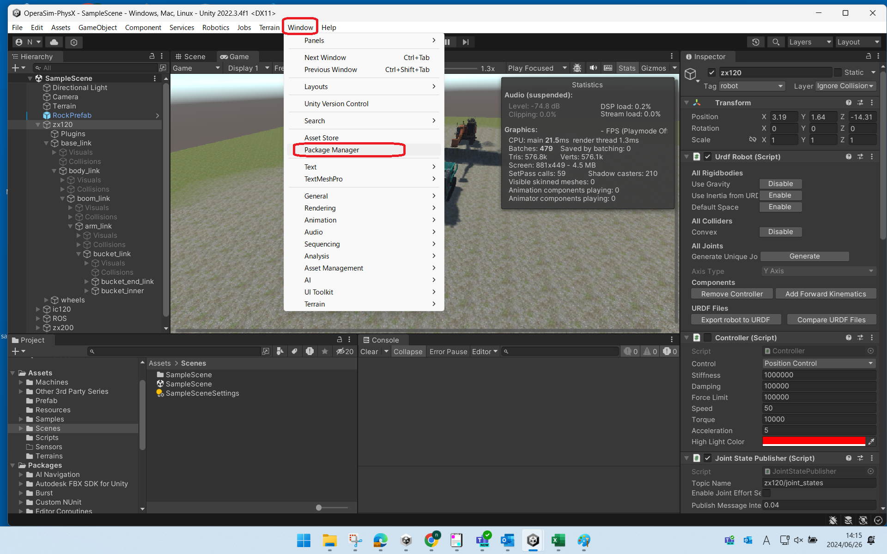
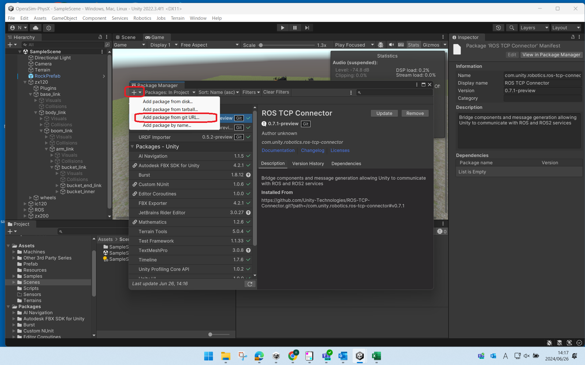
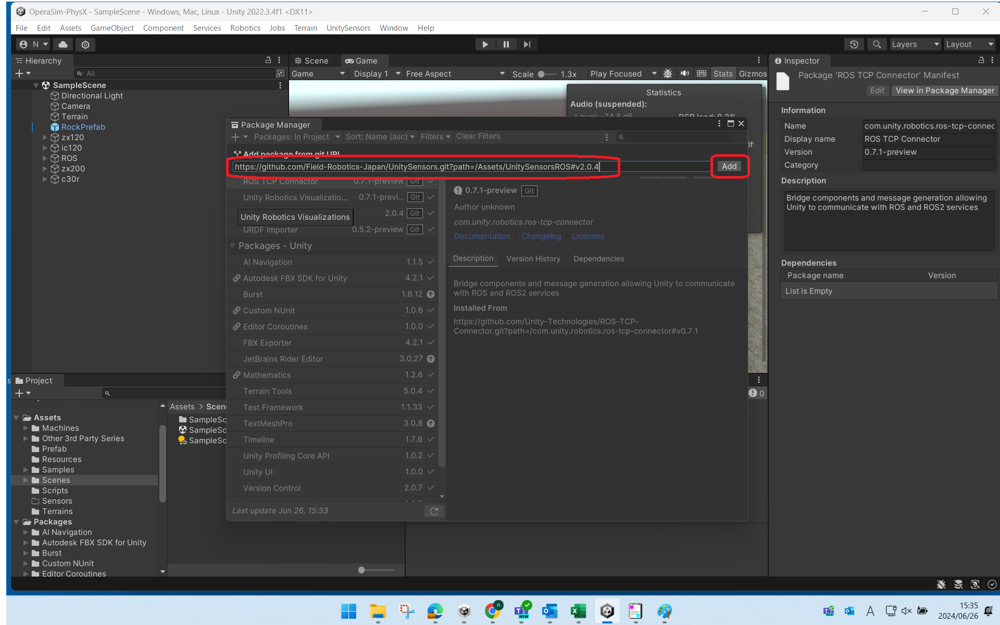
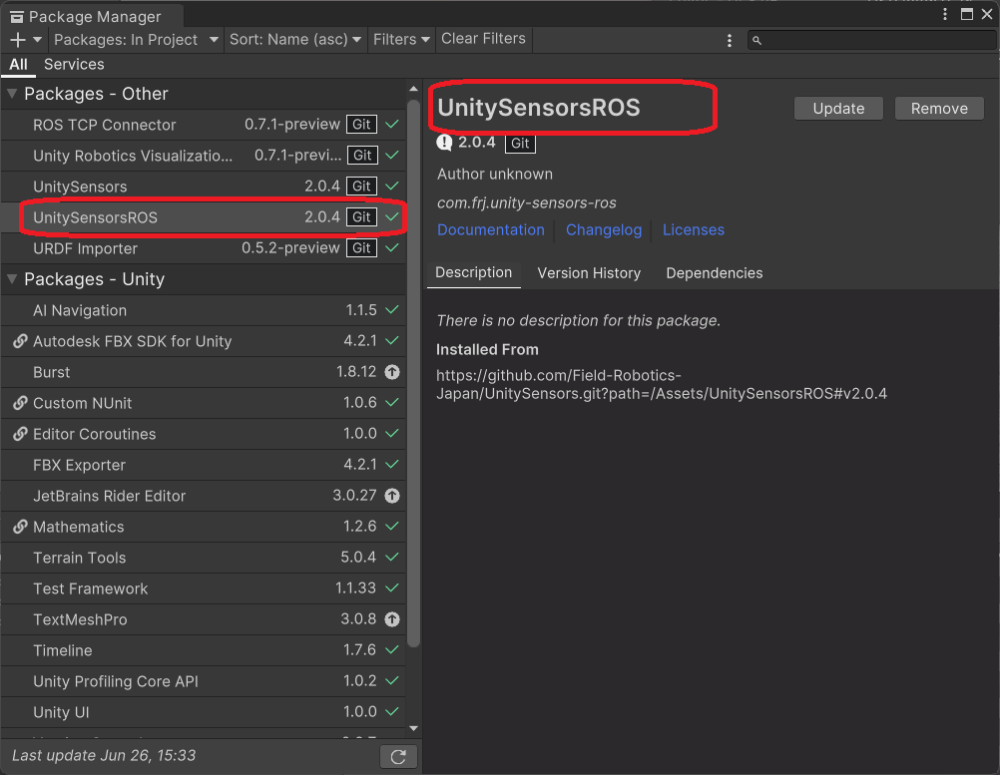
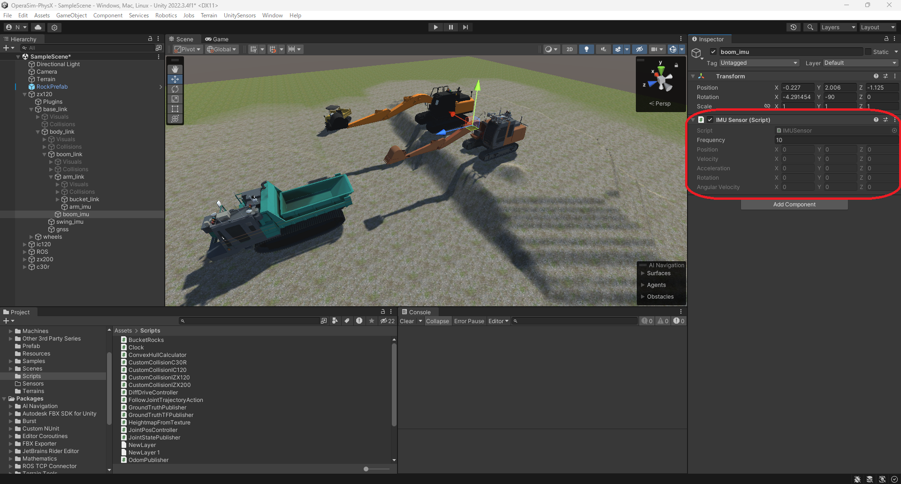

##########################
IMUとGNSSの取り付け方法
##########################

IMUとGNSSの取り付け方法の詳細
===============================

１．ショベル実機のＩＭＵセンサの取り付け位置確認
^^^^^^^^^^^^^^^^^^^^^^^^^^^^^^^^^^^^^^^^^^^^^^^^^^

２．Create Emptyの作成
^^^^^^^^^^^^^^^^^^^^^^^^

  unity メニューバーから「GameObject」「Create Empty」を選択する

３．GameObjectに名称を設定する（例：boom_imu）
^^^^^^^^^^^^^^^^^^^^^^^^^^^^^^^^^^^^^^^^^^^^^^^^

４．UnitySensors パッケージのインストール
^^^^^^^^^^^^^^^^^^^^^^^^^^^^^^^^^^^^^^^^^^^^

  unity メニューバーから「Windows」「Package Manager」を選択する

５．Package Manager ウィンドウのメニューバーから「＋」「Add package from git URL」を選択する
^^^^^^^^^^^^^^^^^^^^^^^^^^^^^^^^^^^^^^^^^^^^^^^^^^^^^^^^^^^^^^^^^^^^^^^^^^^^^^^^^^^^^^^^^^^^^^

６．Package Manager ウィンドウのＵＲＬ入力テキストボックスに下記のURLを入力し「Add」ボタンを押下する
^^^^^^^^^^^^^^^^^^^^^^^^^^^^^^^^^^^^^^^^^^^^^^^^^^^^^^^^^^^^^^^^^^^^^^^^^^^^^^^^^^^^^^^^^^^^^^^^^^^^^^
   「https://github.com/Field-Robotics-Japan/UnitySensors.git?path=/Assets/UnitySensors#v2.0.4」

.. image:: ./img/unity-06.png
   :scale: 100%
   :height: 100px
   :width: 200px

７．UnitySensors パッケージがインストールされる
^^^^^^^^^^^^^^^^^^^^^^^^^^^^^^^^^^^^^^^^^^^^^^^^^

８．UnitySensors パッケージがインストールされたことを確認する
^^^^^^^^^^^^^^^^^^^^^^^^^^^^^^^^^^^^^^^^^^^^^^^^^^^^^^^^^^^^^^^

７．Package Manager ウィンドウのメニューバーから再度、「＋」「Add package from git URL」を選択する
^^^^^^^^^^^^^^^^^^^^^^^^^^^^^^^^^^^^^^^^^^^^^^^^^^^^^^^^^^^^^^^^^^^^^^^^^^^^^^^^^^^^^^^^^^^^^^^^^^^^

８．Package Manager ウィンドウのＵＲＬ入力テキストボックスに下記のURLを入力し「Add」ボタンを押下する
^^^^^^^^^^^^^^^^^^^^^^^^^^^^^^^^^^^^^^^^^^^^^^^^^^^^^^^^^^^^^^^^^^^^^^^^^^^^^^^^^^^^^^^^^^^^^^^^^^^^^^
   「https://github.com/Field-Robotics-Japan/UnitySensors.git?path=/Assets/UnitySensorsROS#v2.0.4」

９．UnitySensors パッケージがインストールされる
^^^^^^^^^^^^^^^^^^^^^^^^^^^^^^^^^^^^^^^^^^^^^^^^^

１０．UnitySensors パッケージがインストールされたことを確認する
^^^^^^^^^^^^^^^^^^^^^^^^^^^^^^^^^^^^^^^^^^^^^^^^^^^^^^^^^^^^^^^^^

１１．unity 「Hierarchy」タブから「boom_imu」を選択し「Inspector」タブを参照する
^^^^^^^^^^^^^^^^^^^^^^^^^^^^^^^^^^^^^^^^^^^^^^^^^^^^^^^^^^^^^^^^^^^^^^^^^^^^^^^^^^

１２．「Inspector」タブから「Add Component」ボタンを押下しIMU Sensor」を選択する
^^^^^^^^^^^^^^^^^^^^^^^^^^^^^^^^^^^^^^^^^^^^^^^^^^^^^^^^^^^^^^^^^^^^^^^^^^^^^^^^^^

１３．「IMU Sensor」のコンポーネントが「Inspector」タブに追加されていることを確認する
^^^^^^^^^^^^^^^^^^^^^^^^^^^^^^^^^^^^^^^^^^^^^^^^^^^^^^^^^^^^^^^^^^^^^^^^^^^^^^^^^^^^^^^

１４．再度「Inspector」タブから「Add Component」ボタンを押下しIMU Msg Publisher 」を選択する
^^^^^^^^^^^^^^^^^^^^^^^^^^^^^^^^^^^^^^^^^^^^^^^^^^^^^^^^^^^^^^^^^^^^^^^^^^^^^^^^^^^^^^^^^^^^^^

１５．「IMU Msg Publisher」のコンポーネントが「Inspector」タブに追加されていることを確認する
^^^^^^^^^^^^^^^^^^^^^^^^^^^^^^^^^^^^^^^^^^^^^^^^^^^^^^^^^^^^^^^^^^^^^^^^^^^^^^^^^^^^^^^^^^^^^^

１６．「Inspector」タブを確認する
^^^^^^^^^^^^^^^^^^^^^^^^^^^^^^^^^^^

１７．unity のPlay ボタンを選択する
^^^^^^^^^^^^^^^^^^^^^^^^^^^^^^^^^^^^^

１８．「Inspector」タブが更新されていることを確認する
^^^^^^^^^^^^^^^^^^^^^^^^^^^^^^^^^^^^^^^^^^^^^^^^^^^^^^^

